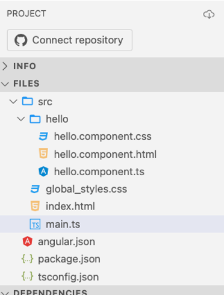
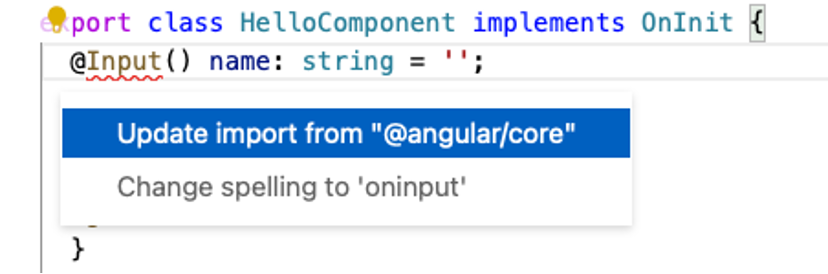
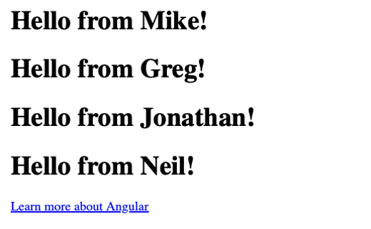

# Gentle Introduction to Angular

_You will want to provide coworkers a Gentle introduction to Angular_

The aim of this chapter is to offer a gentle introduction to Angular, providing your team with the foundational knowledge required to navigate the platform effectively. This is not an exhaustive guide to mastering Angular, but rather an initiation into its unique idioms and patterns - those peculiar 'Angularisms' that form the essence of its syntax and structure.

We'll journey through the fundamental elements of Angular, presenting the core concepts in a clear and accessible manner. This will enable your team members to confidently dive into the code, equipped with an understanding of Angular's fundamental principles. This initial understanding is crucial, as it will serve as the foundation upon which they will continue to build their knowledge and expertise.

To work through the example in this chapter, open a browser to [Stackblitz](https://stackblitz.com/fork/angular). This will provide you with an immediate sandbox where you can follow along. As soon as you do, you should see the following code in the center panel, a file call main.ts.

Raw URL: https://stackblitz.com/fork/angular

```typescript
import "zone.js/dist/zone";
import { Component } from "@angular/core";
import { CommonModule } from "@angular/common";
import { bootstrapApplication } from "@angular/platform-browser";

@Component({
  selector: "my-app",
  standalone: true,
  imports: [CommonModule],
  template: `
    <h1>Hello from {{ name }}!</h1>
    <a target="_blank" href="https://angular.io/start"> Learn more about Angular </a>
  `,
})
export class App {
  name = "Angular";
}

bootstrapApplication(App);
```

## Angular's Concept of Separation of Concerns

Let us start by talking about Angular's concept of separation of concerns. In this sample app, you probably don't see much separation, but it's there. As you create larger apps, you certainly would.

Personally, I would not recommend you combine all these together in one file, except in the simplest of components. That said, there are many proponents of keeping all your component code in one file. Find your own balance; it is probably somewhere in between "always" and "never" doing this.

## Understanding Components

In Angular, UI functionality is encapsulated in components. A component can represent anything from a piece of text, a button, a form, or even an entire page. Components can contain other components, and they can communicate with each other through well-defined interfaces.

You specify that a TypeScript class is a component using the @Component decorator. Decorators provide additional information by annotating or modifying classes or class members.

In this case, the component decorator provides additional metadata to Angular about how the class will behave.

## Understanding Attributes

The `selector` attribute tells Angular to expose this component using the HTML tag `<my-app>`.

The `standalone` attribute tells Angular that this component does not reside in a separate NgModule. Standalone components were first introduced as a developer preview in Angular 15.2.

The `imports` attribute indicates that the code in this component makes use of functionality found inside "CommonModule." We will use some of these functionality later in this chapter, so it's important that we import it.

The `template` attribute directly contains the HTML markup.

## Understanding The Component Class

The executable portion of the component code is found inside the class definition. This one contains a single line of code, meaning it is not doing much.

Even though everything is inside one file, this is what I mean by a "separation of concerns." The code, markup, and styles are all separated from one another.

## Understanding The Markup

Take a look at the markup. It is a TypeScript templated string literal containing pure HTML content.

```html
<h1>Hello from {{name}}!</h1>
<a target="_blank" href="https://angular.io/start"> Learn more about Angular </a>
```

Notice the first line contains a common HTML tag, `<h1>`.

Inside of that tag is an attribute called name, set to the value {{ name }}. This is an Angular "one-way" binding expression. During the page rendering phase, Angular sees that expression, and knows to set the value of the name attribute to the run-time value of the variable name on the component. It would probably be less confusing if they used a different variable name.

Now, change the `name` variable inside the component code and give it a different value. I changed mine to look like this.

```typescript
export class App {
  name = "Mike";
}
```

Look at the result that appears in the right-hand pane. The value you provided should be displayed instead of the original value.


## Hello Component

Let's create a simple component we can use to encapsulate the above message, so that we can reuse it later. In the left panel, find the src folder and right-click it. A menu will appear offering a number of options. Select the one labeled "Angular Generator" and then select Component.



Name your new component Hello. Stackblitz will create a new folder named hello containing three files.

Here, you will be able to see a true separation of concerns, though I would have been fine with keeping it all together for what will be a trivial example. Again, you will eventually find your own balance. There is no right or wrong.

Open up the file `hello.component.ts` and look at its implementation. You first thing you may notice is that its markup is defined in a different file. It also has a `styleUrls` array that we didn't see before. This is the more traditional way to define an Angular component, clearly separating its imperative component code from its declarative markup and styles. The component itself is pretty bland, containing no code at all yet.

It's also missing something critical, at least for our purposes here. This new component is neither marked as standalone, nor is it part of a larger `NgModule`. As standalone components are arguably the future of Angular, let's fix it by adding a `standalone` attribute right after the `selector`. Your `@Component` decorator should now look like this:

```typescript
@Component({
  selector: 'app-hello',
  standalone: true,
  templateUrl: './hello.component.html',
  styleUrls: ['./hello.component.css']
})
```

The component class's constructor and `ngOnInit` function are both blank. You can go ahead and leave them. It won't hurt anything. Above the constructor, add a single line of code:

```typescript
@Input() name: string = '';
```

`@Input` is another decorator, which specifies that `name` is a string attribute that can be provided in the markup of any client that uses this component. Let's do that now.

If you see that `@Input` is underlined in red, it means that StackBlitz didn't import it for you. If you click on `@Input` and look carefully at the beginning of the line, you should see a little lightbulb icon. Click it and StackBlitz will usually offer to do the right thing for you. In this case, its default option is to add the import for us.


Alternatively, you can manually add it to the existing import line from `'@angular/core'`, like this:

```typescript
import { Component, Input, OnInit } from "@angular/core";
```

Either way, you should end up with a line like that one at the top of the file.

Now let's make this component do something interesting. Open the markup file, `hello.component.html`. Delete its contents and add a single line:

```html
<h1>Hello from {{ name }}!</h1>
```

If this looks familiar, it's similar to what we already have seen in `main.ts`.

## Component Reuse

The real power of creating a component like this is that you can reuse the component anywhere, simply replacing its `name` attribute, and it will render consistently.

Back in `main.ts`, we need to import the new component so that we can use it. Find the `imports` attribute. Notice its value is an array. Add `HelloComponent` to the array, right after `CommonModule`. It should now look like this:

```typescript
imports: [CommonModule, HelloComponent],
```

If you did it correctly, StackBlitz automatically imported the `HelloComponent` at the top of the file and you'll see this line at the top of the file with the rest of the imports.

```typescript
import { HelloComponent } from "./hello/hello.component";
```

If that line isn't there, go ahead and click the lightbulb to add it automatically, or manually add it after the other import statements.

### Sidebar: import vs imports

> The TypeScript `import` statement is used to import classes, functions, types, and other exported items from other TypeScript or JavaScript modules into the current file. These imports allow you to use external functionalities within your TypeScript code.
>
> On the other hand, starting with Angular 15.2, the `@Component` decorator now includes an `imports` array. This array isn't related to TypeScript's `import` statement. Instead, it's specific to Angular and is used to provide the compilation context for standalone components. It includes all other components, directives, pipes, and `NgModules` that are used in the template of the standalone component.
>
> So, while both involve the term "import", they serve different purposes.

Now that the `HelloComponent` is available to the component, replace the `<h1>` tag and its contents with a few copies of the `<hello>` tag and provide different names. Something like this, perhaps.

```html
<app-hello name="{{ name }}"></app-hello>
<app-hello name="Greg"></app-hello>
<app-hello name="Jonathan"></app-hello>
<app-hello name="Neil"></app-hello>
```

Now the output should look something like this. Furthermore, we do not have be concerned with how the `<hello>` tag works behind the scenes. We can simply reuse it.



## ngFor

But what if you have a bunch of names? Change the `name` variable on the component and make it an array called `names`.

```typescript
names = ["Mike", "Greg", "Jonathan", "Neil"];
```

The cool thing about reusing components this way is that you do not have to change the `hello` component at all. You simply need to change the calling code to use `ngFor`, an Angular directive used to create multiple instances of the `hello` component based on the number of elements in the referenced array.

You use an `ngFor` by providing it as an attribute to the element you want replicated. The value inside the quotes is the looping expression. It consists of the keyword _let_ followed by the variable name to be used inside the element and any of its children, the keyword _of_, and the name of the array on the component to loop over.

Delete the individual `app-hello` tags, replacing them with a single tag with an `ngFor` expression, like this:

```html
<app-hello *ngFor="let name of names" name="{{name}}"></app-hello>
```

The asterisk, which is required, is an indication to Angular that this directive will manipulate the DOM, or the page's document object model, in some way.

One thing to be aware of when using this type of binding is that the expression inside the curly braces is always converted to a string. This can be an issue when you're trying to bind to an attribute that expects a boolean or a number.

## Attribute Binding

There is another binding syntax that works with HTML attributes. If you want to set the value of an attribute to a value on your component, use square brackets around the attribute name. This is also a type of one-way data binding but instead of converting the value to a string, attribute binding will preserve the data type. For example, if we were binding a boolean in the TypeScript code, it will remain a boolean when passed to the HTML element attribute.

```html
<app-hello *ngFor="let name of names" [name]="name"></app-hello>
```

In general, if you're working with values that should maintain their type (like booleans or numbers), you should use property binding. If you're working with string values or you specifically need a string value, interpolation would be appropriate. I'll show you more about that soon.

## HTML Event Binding

You can also bind to HTML events. Any event can become a trigger to execute a function on the component. The simplest way to illustrate that is to create a button and provide a click handler.

You do that by surrounding the event name (in this case, click) with parenthesis. Then inside the quotes, call the component function you want to execute.

You can pass parameters to the function, which is often the case when creating an event binding inside an \*ngFor, passing the current looping variable to the event handler.

In this case, just call toggle(). Let's get rid of that `<a>` tag and replace it with the following code:

```html
<button (click)="toggle()">Click Me</button>
```

Back inside the component class itself, we'll need to implement the toggle function. Add this code inside the app component, right after the names array.

```typescript
isToggled = false;

toggle() {
  this.isToggled = !this.isToggled;
}
```

Now when you click the toggle button, the value of the `isToggled` variable will flip between true and false.

## ngIf

The `isToggled` variable is useless until you do something with it. Add a new line inside the component's template. That's where ngIf comes in. It's used to conditionally add or remove an element from the DOM based on an expression. If the expression evaluates to a truthy value, the element is added to the DOM. If it's a falsy value, the element is removed. This makes ngIf very useful for controlling the visibility of elements based on conditions in your TypeScript code. Remember that, as a structural directive just like ngFor, ngIf is used with an asterisk (*) before the directive in your templates, like this: *ngIf="condition".

In this case, let's add a paragraph tag, give it an ngIf directive, and set its condition to "isToggled."

```html
<p *ngIf="isToggled">I am toggled on!!!</p>
```


Now as you click the button, that paragraph will appear and disappear.


Those are the basics you need to know to work with Angular.

## Summary

The concepts we've covered so far form the cornerstone of Angular development. They are the building blocks you need to get started with creating dynamic, robust Angular applications. However, Angular is a vast framework with numerous features and best practices. For more detailed and comprehensive information, the [Angular official documentation](https://angular.io) is an invaluable resource. The raw URL is `https://angular.io`. It provides in-depth guidance on Angular's various features, from basics to advanced topics. And rest assured, this is just the beginning. Throughout the rest of this book, we'll delve deeper into Angular, exploring more complex concepts and features, building more intricate applications, and mastering this powerful framework.
