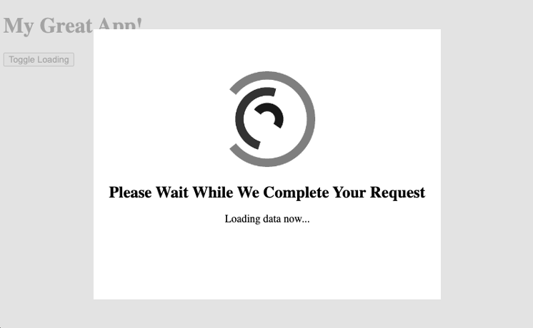

# A Simple Angular Component

Embracing simplicity can often lead to powerful results, and Angular components are no exception. With just a dash of HTML and CSS, we can craft reusable components that can become the cornerstone of any project. This chapter will guide you through the process of creating one such universally applicable component - a 'Loading' indicator.

In the realm of web development, one of the most common requirements is a visual indication of data being fetched from a remote service. A Loading indicator serves this purpose, subtly communicating to the user that their request is in progress and that the application is actively working to retrieve their data. Angular's robust framework makes the creation of such a component impressively straightforward.

So, let's delve into the intricacies of crafting a reusable Loading indicator with Angular, illustrating just how simple and effective component creation can be. You might find that Angular's simplicity and power make it a joy to work with, transforming even the most mundane tasks into engaging challenges.

As we progress through this journey, I encourage you to follow along in your code editor of choice. The beauty of coding is that it's accessible from a variety of platforms - be it Atom, Sublime, WebStorm or any other tool that you're comfortable with. However, for the purpose of this guide, I'll be using Visual Studio Code (VS Code) and the Angular CLI that we installed in the previous chapter. VS Code provides an intuitive and user-friendly interface, while the Angular CLI makes it easy to create, manage, and build Angular applications. Remember, the goal is not just to read and understand, but also to get your hands dirty with actual code. There's no better way to learn than by doing.

## Create a New Angular Application

Before we dive into creating our "Loading" component, we need an Angular application to house it. This is where the Angular CLI, installed in the previous chapter, comes into play. The CLI, or Command Line Interface, is a powerful tool that allows us to scaffold and manage Angular applications directly from the command line.

We'll start by creating a new Angular application. Open your terminal and navigate to the directory where you'd like to create your project. Then, type the following command:

```bash
ng new --standalone
```

This command asks the Angular CLI to create a new application with the `standalone` format introduced in Angular 15.2. Follow the prompts that appear after running this command to set up routing and select a stylesheet format. For the sample code in this book, using the Angular Router and CSS for styles will suffice. Once the process completes, you’ll have a fresh Angular application ready for development.

Before you go any further, open the app.component.html file and remove its contents. Angular gives you a lot of content, but it’ll just get in the way and confuse things. If you want to leave something like `<h1>My Great App!</h1>`, that’s fine.

Navigate into your new project’s directory using the command `cd <app-name>`. Now we're set up and ready to create our "Loading" component.

## Create the Component

To create the component, I used the Angular CLI. I like to use the integrated terminal inside of VS Code, but use whatever you’re comfortable with. Whatever you use, ensure that you are physically in the root folder of the application you just created.

```bash
npx ng generate component Loading --skip-tests --dry-run
CREATE src/app/loading/loading.component.scss (0 bytes)
CREATE src/app/loading/loading.component.html (22 bytes)
CREATE src/app/loading/loading.component.ts (301 bytes)
```

This command asks the Angular CLI to generate a new component named "Loading", not to bother generating a test file (I will explain why not shortly) and then simply show me what the command will do (--dry-run).

I almost always do a dry run before having the CLI generate anything for me. That way, I can see what files it will create and where it will put them. On some projects I like to organize components differently than the default folders. Seeing the file paths before creation gives me a chance to correct them, simply by pre-pending the path to the name of the component.

In this case, I am comfortable with the component living in its own folder under app, so I can rerun the command without the --dry-run flag.

```bash
npx ng generate component Loading --skip-tests
CREATE src/app/loading/loading.component.scss (0 bytes)
CREATE src/app/loading/loading.component.html (22 bytes)
CREATE src/app/loading/loading.component.ts (301 bytes)
```

A note about the npx prefix: I need to add this to the command because my ng is not installed globally. Using npx causes the Angular CLI installed in my project's node_modules folder to be used. If your Angular CLI is installed globally, you can omit the npx prefix.

## Component Code

This is the simplest part because there really is no logic to speak of. I am simply creating a visual component with no other behavior.

Inside the file loading.component.ts, the generated code looks like this:

```typescript
import { Component } from "@angular/core";
import { CommonModule } from "@angular/common";

@Component({
  selector: "app-loading",
  standalone: true,
  imports: [CommonModule],
  templateUrl: "./loading.component.html",
  styleUrls: ["./loading.component.css"],
})
export class LoadingComponent {}
```

As I said, there is not much here. After the two imports is the @Component decorator, which defines how the component will be implemented. selector defines the custom component's HTML tag. This is how the component will be placed on a page.

```html
<app-loading></app-loading>
```

You can also see that `standalone` is set to true, meaning we will not need an `NgModule` to use the component. Following that is the `imports` array which we saw in the Gentle Introduction to Angular. Finally, the `templateUrl` and `styleUrls` are specified. These two lines tell the Angular compiler (and us) where to find the markup and styles for the component, respectively.

Next is the class body itself, which should be empty. We’ll fix that now by adding two variables.

```typescript
import { Component, Input } from "@angular/core";
import { CommonModule } from "@angular/common";

@Component({
  selector: "app-loading",
  standalone: true,
  imports: [CommonModule],
  templateUrl: "./loading.component.html",
  styleUrls: ["./loading.component.css"],
})
export class LoadingComponent {
  @Input() label = "";
  @Input() shown = false;
}
```

The `@Input` decorators tell Angular to expose those two variables as attributes on the custom HTML tag.

- `label` will be bound to some text in the HTML so that we can tell the user exactly what is loading. If you do not need that, you could eliminate it entirely.
- `shown` allows the host to show or hide the component as necessary. Something like this:

```html
<app-loading label="Loading data now..." [shown]="isLoading"></app-loading>
```

With this example markup, I have hard-coded the loading message, but have bound the shown attribute to a variable on the host component. Whenever `isLoading` is true in the host component, the loading component will be visible; otherwise it will be hidden. That is all the host needs to be concerned with. How the visibility is implemented inside the loading component is irrelevant to the host.

## Markup

Now let us take a look at the markup. This, too, is pretty simple, almost trivial.

```html
<div class="wrapper" [class.hidden]="!shown">
  
  <h1>Please Wait While We Complete Your Request</h1>
  <p>{{label}}</p>
</div>
```

The component consists of a single `<div>` with a class called `wrapper`, which I show in Figure 4.1. We will see more of that in the next section on styling. Inside this `<div>` are three more elements:


- An `` tag pointing at an animated gif. You can use any animated gif you’d like. I found a suitable one at pixabay.com (which I’ll touch on in more detail later in the book. For reference, this is the image I used: [Pixabay Image](https://pixabay.com/gifs/load-loading-process-wait-delay-37) or https://pixabay.com/gifs/load-loading-process-wait-delay-37.
- The image is placed in an images folder just inside the loading component’s folder. At build time, it will be copied to the correct place and referenced appropriately.
- A title represented by an `<h1>` tag containing a hard-coded message to the user.
- The final piece of content is a `<p>` tag with its text bound to the `@Input() label` field on the component. Whatever the host component passes as the label attribute will be displayed here.

## Styling

The real magic happens in the component's stylesheet. I will show the entire thing, followed by an explanation of the relevant sections.

```css
h1 {
  line-height: 30px;
  font-size: 24px;
}

.loader {
  width: 150px;
  height: 150px;
  display: inline-block;
  background-image: url(images/loading.gif);
  background-repeat: no-repeat;
  background-size: contain;
}

.hidden {
  display: none;
}

.wrapper {
  text-align: center;
  font-weight: 400;
  line-height: 18px;
  padding: 60px 20px 20px 20px;
  background-color: #ffffff;
  z-index: 9000;

  width: 480px;
  height: 326px;

  position: absolute;
  top: 50%;
  left: 50%;
  transform: translate(-50%, -50%);

  outline: 9999px solid rgba(217, 217, 217, 0.75);
}
```

## h1

The first rule is for the `<h1>` tag, and it is pretty straightforward. It simply sets the font-size to 30px, and the line-height to a slightly lower value. These values do not materially change the component. They are purely aesthetic and you could change them to reflect your own personal style. One thing of note is that the Loading Component will inherit its host's font selection, whatever that may be.

## .div.loader

The elements with the class `.loader` have a width and height of 150 pixels, and are displayed as inline-block. They have a background image set to images/loading.gif, with no repeating and a background size set to contain. This is the animated gif. INSERT IMAGE HERE One of the little bits of “magic” that Angular does for us is that it will ensure that the image referenced in the CSS file will be copied to the right place at build time and the CSS references updated as needed.

## .hidden

The component's visibility is driven by this class. The wrapping `<div>` either does or does not have this class set, based on the value of the shown attribute.

Why did I not put the hidden class on the host and let the host handle it directly? The reason I wanted to use shown is so that I could change the visibility implementation at will, without changing any of the host code. For example, I could add some CSS animation or implement some other complex code, all without the host components even knowing about it. They would continue to set `[shown]` as they do now.

## .wrapper

This is the big one, so I will show the code again for convenience, explaining it as I go.

```css
text-align: center;
font-weight: 400;
line-height: 18px;
padding: 60px 20px 20px 20px;
background-color: #ffffff;
z-index: 9000;
```

You can see some various rules that dictate how the component looks. The first line indicates that everything inside the wrapper will be centered, text and images both. The next three lines set the text font-weight to 400 (normal), a default line-height of 18px, and some internal padding to provide whitespace.

It has a background color of white, indicated by the value #ffffff.

The z-index of 9000 is a relative position of depth. Elements with larger numbers appear "on top of" or "in front of" elements with a z-index value that is smaller. Setting the loading component's z-index to 9000 gives it a decent likelihood that no other elements will appear in front of it. Should you find that is not the case, set a higher value. Browsers do not seem to have a standard "maximum" value, but most modern browsers should allow values up to \(2^{31} - 1\).

```css
width: 480px;
height: 326px;
```

These two values simply set a fixed width and height for the component. We could be clever and specify values in terms of window or viewport size, but I wanted to keep this part simple. Feel free to experiment with different values. That’s what source control is for, right?

```css
position: absolute;
top: 50%;
left: 50%;
transform: translate(-50%, -50%);
```

This next block helps to position the loading component. The combination of positioning the element at top: 50% and left: 50%, along with the transform: translate(-50%, -50%) property, is commonly used to center an element horizontally and vertically.

Setting top: 50% and left: 50% positions the element's top-left corner at the exact center of its parent container. However, this alone would not center the element perfectly, as it would be offset by half of its own width and height.

That's where the translate(-50%, -50%) comes into play. It moves the element back by 50% of its own width and height in both the horizontal and vertical directions. This effectively centers the element perfectly, regardless of its size.

By combining these positioning and transformation properties, you achieve a consistent and reliable way to center an element both horizontally and vertically.

```css
outline: 9999px solid rgba(217, 217, 217, 0.75);
```

The clever bit I find is the last line: outline. The component's outline is being defined as a 75% opaque (i.e., 25% transparent) solid gray line 9999px wide. This ends up covering the entire host component with the outline, preventing it from being selectable.

And that is the entire component!

## Use

I hinted at its use above, but there are three things you would need to use it in your own project.

1. Include the source files.
2. Import the component in the host’s components imports array.
3. Supply some HTML markup to call it, which looks like this.

```html
<app-loading [label]="loadingText" [shown]="isLoading"></app-loading>
```

In this sample code, I am using Angular's attribute binding syntax to bind the label and shown attributes to the host component's loadingText and isLoading variables, respectively. Changes to these variables on the host component will cause Angular to re-render the loading component as necessary.

If you are following along, you should be able to drop the component right onto the app.component.html page, like this:

```html
<h1>My Great App!</h1>

<button (click)="load()">Toggle Loading</button>

<app-loading label="Loading data now..." [shown]="isLoading"> </app-loading>
```

In addition to the `<h1>` element displaying the text "My Great App!", you can see I’ve added a `<button>` element with the label "Toggle Loading", and an `<app-loading>` component that shows a loading message when the isLoading variable is true.

To set that isLoading variable, all you need to do is add that load() function inside of app.component.ts. One possible implementation could be:

```typescript
load() {
  this.isLoading = true;
  setTimeout(() => {
    this.isLoading = false;
  }, 2500);
}
```

The load function will set the isLoading property to true, which will trigger the display of the loading component. After a delay of 2500 milliseconds, the isLoading property will be set to false, hiding the loading component.

## The Result

Start the Angular server by typing `ng serve` or `npm start` at the command line. You should end up with something like Figure 4.2.


When you click the button, you'll see the component in action, as show in Figure 4.3.



## Summary

In this chapter, we've debunked the notion that Angular components have to be complex. We've demonstrated that, with minimal HTML and CSS, it's entirely possible to craft a reusable "Loading" component. This component, with its simple yet efficient functionality, can be easily incorporated into any part of our application, enhancing the user experience whenever data is being fetched.

Moreover, with a bit more tweaking and refinement, we can evolve this component into a standalone entity. Such a standalone component, decoupled from specific project dependencies, could be a versatile tool in your development toolkit, ready to be dropped into any Angular project you work on.

But where could we use such a component? That's what we'll explore in our next chapter. We'll delve into practical applications for our "Loading" component and see how it can enhance the interactivity and responsiveness of our applications. So, stay tuned, and let's continue this journey of learning and discovery together. As always, I welcome your thoughts and suggestions on how we can improve and optimize this component further.
