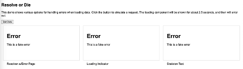

# Resolve or Die – Error Handling Strategies for Loading Data

## Angular Route Guards and Resolvers

Angular provides a powerful mechanism for controlling access to routes in your application—Route Guards. These sentinel-like entities effectively ensure that certain conditions are met before a route is activated. Are you wondering if a user is authenticated? A Route Guard can verify that. If the user isn't authenticated or doesn't belong to the appropriate authorization group, access to the guarded route is denied. Route Guards embody the Single Responsibility Principle, are easily mockable for unit tests, and significantly enhance the security of your application. But this raises a question—where do Route Resolvers fit into this picture?

Let's explore Route Resolvers. Similar to Route Guards, Route Resolvers serve as gatekeepers, but with a nuanced difference. Rather than preventing the user from accessing a page, a Resolver ensures that certain preconditions are met before the route is fully activated. Typically, Resolvers preload necessary data for a page before it renders.

Consider a scenario where you have a page showing order status to the user. The route might look something like this: `/orderstatus/:orderId`. A Route Guard would verify that the logged-in user is associated with the requested order. That's the straightforward part, but what about a Route Resolver? Should you also ensure that the order details are preloaded before the page displays? The answer, as we'll see, isn't black and white—it depends. Let's dive deeper and explore these crucial concepts.

## What Data Are You Loading?

In the above scenario, you need to load the order details: what items are on the order, which of those items have been shipped or on back-order, and the tracking information for the items that have been shipped. There may be other details your system has to load. Maybe the item descriptions and payment information come from other systems, and you want to display those, too. The questions you need to ask yourself are which data items are so important that you will not even want to display the page without them? And what if you cannot load those items?

The answer to the first question is really an application design decision. Do you want to ensure that all the order details have been successfully loaded before the Order Status Page appears? Or is it acceptable to render the page partially, and allow the order details to appear as its data is returned? If the order status typically takes less than a second to load completely, waiting for it might be acceptable.

## What If There Are Errors?

Depending on which pattern you choose, you then need to decide what to do if one or more pieces of data cannot be loaded. A service could be down, the network could be flaky, etc. It really does not matter. What do you do?

### Give up on Error

If you are using a Route Resolver, and it encounters an unhandled exception, the route will not resolve, and your page will simply not render. This is obviously not ideal, and you should throw out this idea immediately.

You could catch and log the error, setting the data being loaded to an empty or default object, and then letting the resolver complete successfully. If you do that, you need to think of what the rendered page would look like. Is it still useful for the person trying to load the page? If the answer is yes, then perhaps this is an acceptable solution. You can actually make this choice a case-by-case decision, based on the importance of data being loaded. If it is not "mission critical", go ahead and let the page load.

### Redirect to an Error Page

On the other hand, maybe your data is so critical that not a smidgen of the page should appear until it is all available. If any missing piece of data causes the page to be useless, consider redirecting to an error page with an explanation of what went wrong. You could optionally provide a link on the error page, allowing the user to retry. After all, it may have been a temporary blip.

Here is some sample code that illustrates one way to redirect to an error page if any errors are encountered in the Resolver. The primary advantage to this method is that the page itself need not be modified, or even know about the resolver. If the component loads, you can be sure that the data is there. Thus, the code I am showing here is the resolver itself, and I am not showing the page component.

The Resolver shown below is an example of Angular’s functional resolver. The class-based resolvers have been deprecated and will be removed from Angular soon.

```typescript
export const dataResolverResolver: ResolveFn<boolean> = (route, state) => {
  const dataService = inject(DataService);
  const router = inject(Router);

  dataService.getData().pipe(
    map((data) => {
      // Here we would do something with the data
    }),
    catchError((error) => {
      router.navigateByUrl("/error");
      throw error;
    })
  );
  return true;
};
```

## Maybe Not Use a Resolver

Going back to the Order Status scenario, imagine that there is really only one piece of data that would make the entire page useless. And even then, if the page renders without this data, and instead displays an inline error, what is the ultimate harm?

Allow me to suggest another option. Consider not using a Route Resolver at all.

### Loading Indicator

A common pattern I am sure you have seen is to render the complete page, but with no data. The page displays a "Loading" indicator of some sort while the order details are retrieved, with the page in a non-interactive state. Once the details are available, the indicator disappears and the user can interact with the page at that point. This is a pretty common pattern, which we have all seen.

Here is some sample code that implements this pattern, using the loading indicator from the last chapter.

The `getData()` function is asynchronous so that it can use promises. I would normally use RxJS throughout my code, but I didn’t want it to get in the way of what we’re discussing here.

```typescript
export class LoadingExampleComponent implements OnInit {
  errorText = "";
  isLoading = false;
  data = "";

  // Alternative service injection
  // dataService = inject(DataService);

  constructor(private dataService: DataService) {}

  ngOnInit() {
    this.getData();
  }

  async getData() {
    this.errorText = "";
    this.isLoading = true;

    try {
      this.data = await firstValueFrom(this.dataService.getData());
    } catch (error: any) {
      this.errorText = error.message;
    } finally {
      this.isLoading = false;
    }
  }
}
```

And this is some markup that would go with it. The error message `<p>` tag, including the retry link, is only displayed if the string is not empty.

```html
<p>Data from service: {{ data }}</p>
<p *ngIf="errorText">Error: {{ errorText }}. You can <a (click)="getData()">retry</a>, or <a href="/home">return home</a>.</p>
<app-loading label="Loading data now..." [shown]="isLoading"> </app-loading>
```

## Skeleton Text

Yet another pattern renders the page with skeleton text, gray text bars in place of where the details will eventually appear. The page is fully interactive, giving the impression of faster performance, while the other details load. As the data is loaded successfully, it replaces the skeleton text. Any piece of data that fails to load could be replaced with an error message and a retry link.

For this demo, I selected the ngx-skeleton-loader from [npmjs](https://www.npmjs.com/package/ngx-skeleton-loader) (https://www.npmjs.com/package/ngx-skeleton-loader).

Here is some sample code to implement this pattern. It is mostly the same, with very minimal UI changes. I find this pattern to be a lot cleaner, because the error message and skeleton text visibility are both managed entirely by the view layer (i.e., the HTML).

There is more markup than in the prior example, primarily due to the inclusion of the skeleton text. The method of displaying the error and retry link is identical. However, the skeleton text is hidden as soon as either the data or the error message has a value.

```html
<div *ngIf="errorText && !isLoading">
  <h1>Error</h1>
  <p>{{ errorText }}</p>
</div>
<div *ngIf="isLoading">
  <h1>
    <ngx-skeleton-loader></ngx-skeleton-loader>
  </h1>
  <p>
    <ngx-skeleton-loader [count]="3"></ngx-skeleton-loader>
  </p>
</div>
```

Either of these alternative patterns can be handled by kicking off the data load by clicking a button or during ngOnInit, calling into the same data service the Route Resolver would call. This strategy maintains a proper separation of concerns, and allows the service to be mocked during testing.

## Demo

Here is a demo I created with the above code to show all three of these options side-by-side. The demo consists of three Angular page components, each attempting to load some data from a common service, as you can see in Figure 6.1. The service simply waits 3.5 seconds and throws an error, as shown in Figure 6.2.

### Loading


### Error State



If you wish to see the demo code in its entirety, please see the GitHub repo included with the book’s extras.

Note, I used a different “loading” indicator because the one we wrote in the last chapter takes up the whole page. Feel free to swap it out for that one as an exercise if you wish.

## Summary

I wrote this in response to a real situation I had in a recent project. The main page needed four different pieces of data, all loaded from separate sources. The implementation used a Route Resolver to ensure all the data loaded before the page appeared. During testing, one of the services was down and was timing out after 30 seconds. This means the user was kept staring at a white screen until the service gave up. Obviously, this experience is not ideal, and led me to research other (better?) options.

As part of that research, I came up with some rules guidelines for deciding how best to load asynchronous data:

- If your page absolutely cannot be shown unless/until all data is loaded, use a resolver.
- Do not ignore errors in your resolver, or your page will not render and the user will be stuck in limbo.
- Redirect the user to an error page, optionally with a retry button.
- If your page is still somewhat useful with partial data, load the data asynchronously in ngOnInit.
- Use skeleton text or a loading indicator.

Try all the options yourself to see how each one behaves and choose the option that works best for your projects.
