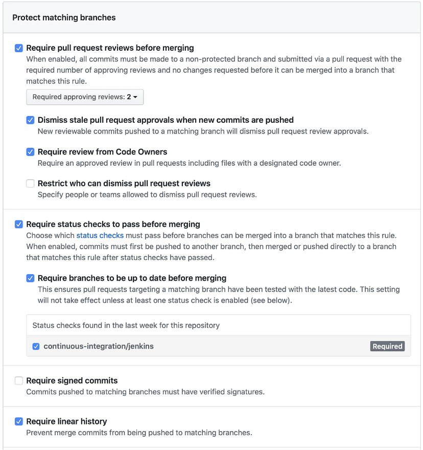

# Source Control - In Search of a Better Code Review

## How to set up GitHub to smooth your team's development process

Source control is of vital importance in modern software development. As a developer, you need to be confident that you can recover from mistakenly deleting your code. It should be easy to create "what if" experiments that are trivial to undo if necessary. Also, developers rarely work alone. A good source control system make it convenient to work with others and incorporate their changes into your code, and vice versa.

There are plenty of opinions about the best way to handle code reviews and pull requests on a software project. Some teams and companies are very strict, requiring multiple levels of reviewers and only a few people authorized to perform merges. Other teams are at the opposite extreme, allowing anyone to merge their branches at any time with no oversight whatsoever. In this article, I will propose something in the middle.

## The Problem

In one of my projects, there were few developers and only a single authorized code reviewer (ACR). The ACR was the only person with write permissions to the protected branch, `develop` in our case. Thus, he was the only person who could approve and merge feature branches into `develop`. Interestingly, though the ACR was a member of the team, he was not assigned any development responsibilities on the project. He had responsibilities to other projects, so his time was understandably dedicated to those projects primarily. The feature development process had feature branches created and pushed to origin, with pull requests following. At that point, the pull requests would back up, waiting for days or sometimes even weeks to be reviewed.

There were not enough developers on this particular project to enlist others to help with development or code reviews, and it got frustrating quickly.

I decided to research a more efficient and effective process.

## Goals and Constraints

My goals are to reduce the time it takes for a pull request to be opened, reviewed, and merged with our main development branch.

Some of my constraints are that code is hosted on an internal GitHub instance in private repositories. This limits the pool of potential reviewers.

## Recommendation

If you simply want to see my recommendation, you can read this section and stop. The remainder of the article will be my supporting arguments and reasoning which led me to this recommendation.

## Development Work Flow

This is a sample code flow I envision for any given feature:

1. A developer (Pat) is assigned a new feature.
2. Pat creates a new branch (FB) from the HEAD of the "main" branch (or whatever it is called in your repository). Note: Pat does not fork the repository, but has write access to it.
3. Pat implements the feature into FB, using as many commits as necessary.
4. When complete, Pat pushes FB to origin and opens a pull request.
5. Pushing FB automatically starts a build of FB, and the build status is reported back to the repository.
6. If the build fails, the system will not permit FB to be merged.
7. The repo contains a `PULL_REQUEST_TEMPLATE.md` file, which encourages consistency in pull request descriptions.
8. Pat requests that two or more peers review the pull request.
9. The "Code Owner" for the repository is automatically assigned to review the pull request.
10. If any reviewer requests changes with the code review, Pat cannot continue with the pull request until those changes are addressed.
11. Once the changes are addressed, Pat pushes new commits to FB, at which time all existing reviews are dismissed, and the process begins again.
12. If the main branch is updated while the pull request is open, Pat must merge those changes into FB before it can be merged.
13. This cycle is repeated until all reviewers have approved, FB is consistent with the main branch, and all builds of FB pass.
14. At this point, Pat is free to merge the pull request and delete FB.

## GitHub Protected-branch Settings

Here is a description of my recommended settings for protecting the base branch. Figure 17.1 shows them all together, after which I will describe them in more detail.

## The Rationale

This section contains a more detailed explanation of the above workflow.

### A Single Protected Branch

I propose protecting a single branch, in our case the `develop` branch, which is where all our feature branches get merged into. This can be known as the "main" branch, the "base" branch, etc. I use all three terms interchangeably.

### Write Access for the Entire Team

In order for this recommendation to work effectively, each member of the team must have write access to the repository. This enables a feature branch to be created directly in the repository, rather than forcing developers to fork the repository. The benefit is that code reviewers can easily pull the feature branch onto their own machine for testing (if necessary), instead of having to clone the forked repository. Using forked repositories was common in the past, before the introduction of protected branches. It still is common practice in open source projects, where features can be contributed by virtually anyone. In a corporate setting, the latter use case is unlikely.

### Pull Request with Template

Each repository should include a pull request template file (named `PULL_REQUEST_TEMPLATE.md`) to help keep pull request descriptions consistent between features and developers. At a minimum, the template should prompt the developer for the following information:

- A link to the "user story" or issue that the pull request addresses.
- A high level summary of the changes.
- A quick start on how to build and test the branch. Remember, some reviewers may be from another team and may not be intimately familiar with the project.
- What to look for in the application.

#### Optional

The pull request template may also contain prompts for these items:

- Test and Linting results (though this can be managed by the status checks).
- Screenshots of the current implementation UI, if relevant.
- Any additional context to help review and test the pull request.

### Authorized Reviewers

This is where things get interesting. I propose following the model of an external company, [pullrequest.com](http://pullrequest.com). They use code reviewers who are completely removed from the project, and even the company requesting the reviews. These reviewers provide a fresh perspective unavailable from those doing active development on the project. Such individuals need only read access to the repository.

The primary benefit to this is numbers. More potential reviewers implies a faster time to first comment, which results in quicker pull request turnaround.

In addition, every developer on the project should be an authorized reviewer.

Given that all our reviewers have access to the corporate network, we can take an additional step. We should allow and encourage our reviewers to clone the repo, and then build and run the application from the feature branch.

A useful side-effect of including reviewers from outside the immediate team is that helps to avoid siloed knowledge. At any time in the future, reviewers could potentially be tapped to join the project, either temporarily or permanently, and not come into the project blind.

### Strict Status Checks

In our case, we are integrated with a Jenkins build pipeline. All branches pushed to `origin` are built, code analysis is performed, and all unit tests are run. The status of this build and test phase are reported back to GitHub and the pull request containing that branch. Before collaborators can merge changes into the protected branch, this build must completely succeed.

### Require FB to be up-to-date with the main branch

The feature branch in a pull request will need to be up to date after other collaborators merge pull requests to the protected base branch. This puts the burden of merge conflicts onto the feature developer, the person closest to the code and most likely to resolve them quickly.

### Required Code Owner Review

Each project should have one or more "code owners" who are not part of the development team. They could be technical managers, development leads from another project, or senior architects. The code owners are specified by providing a `CODEOWNERS` file in the root folder of the base branch. The interesting thing about this approach is that different code owners can be assigned for different file types, branches, etc. The details of whom to be assigned as code owner can be determined by the project team.

The code owners' responsibilities will not be to review the code in detail, but simply to review the other reviews to ensure that they have been completed satisfactorily. Once the appropriate code owners have reviewed and approved the pull request, no additional reviews are required.

## Require Linear History (Use Squash Merges from Feature Branches to Main Branch)

This recommendation is all about reverting features in case problems are discovered later. If a protected branch requires a linear history, then only squash or rebase merges are permitted. I recommend the former. When a squash merge is performed as part of a pull request, the entire feature branch is merged into the base branch with a single commit. While it is a "best practice" to make multiple commits during development, this can lead to more difficult merge conflicts for developers on other branches. Using a squash merge from a feature branch to the base branch will reduce the feature to a single commit, making it easier for other developers to pull those changes into their own feature branches. It also helps in the event that the feature branch needs to be reverted. Providing a single reverse commit can undo the entire pull request, if it becomes necessary to remove a feature from an upcoming release.

## Merge Completed by Code Author

When all reviews and status checks are complete, it is up to the original feature branch author to perform the merge and delete the feature branch if desired. Whether or not you delete feature branches is a decision best left to the development team. I like deleting them and keeping the origin clean, but some teams prefer to keep them around.

## What about Automatic Merge?

GitHub has an option to merge automatically once all other gates are passed. I am tempted to recommend that, but I would only push for it if it turns out the build/test/deploy cycle is too lengthy.

## Conclusion

I hope this has been helpful. You may or may not agree with some of my suggestions, which is fine. What I hope to have impressed upon you is that code review and pull request policies are flexible in GitHub. Your team should discuss what will work best for your project based on your developers' experience and needs.

If nothing else, I hope you will have enough information to have the conversation.
