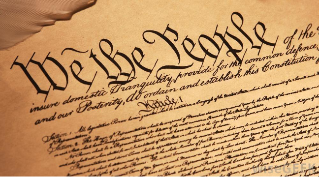

# Slow Down to Be Noticed

If you want to have a more positive impact on those around you in your daily life, personal or professional, I have two words of advice: slow down. I will explain the details and benefits in this chapter.

## Background

I get asked from time to time what kinds of advice I have for people looking to get ahead, be taken seriously, or just be thought of more positively. After an experience I had with some young men at church, one of my favorite suggestions is to recommend they try slowing down their speech.

Though the events below happened in a religious setting, the principles I will describe apply equally in personal, academic, and professional settings. Allow me to set the stage.

I was facilitating a Sunday meeting at church with some of our older teenagers. We were taking turns reading scripture and it seemed that everyone, myself included, was simply going through the motions. We heard the words, but there was little meaning being conveyed.

## An Idea Took Shape

I stopped everyone and suggested that we start over, but this time with a twist. I chose one of the young men and asked him to read a somewhat lengthy verse in his normal cadence, while I timed him. I asked the rest of them to close their eyes and just listen. His time, as I recall, was somewhere around 25 seconds.

Then I asked him to read the same verse again, but this time as slowly as he could without feeling uncomfortable. I asked the others to close their eyes and listen once more, and again I timed him. It was less than 35 seconds. Longer, but not dramatically so.

The result, however, was very dramatic. The mood in the room changed. Everyone sat still, absorbing a scripture passage they had now heard three times. It seemed to take on an entirely new meaning.

In fact, it was close to magic.

The boys then took turns with this experiment. Though each read and spoke much more slowly than normal, none sounded unnatural or forced. Their words were clear and distinct, each syllable perfectly enunciated.

By the end of the experiment, each was convinced that there was something to this. I challenged them to try to apply this in their everyday lives. In school, read more slowly and with greater intent. Also try to speak more slowly and clearly. I promised them that if they made a conscious effort, then they would see positive results. They accepted.

## Demonstration

Reading about this experience will only provide you with half of the story. I want you to understand what I am telling you at a deeper level.

To demonstrate, I recorded myself reading the Preamble to the US Constitution (See Figure 23.1) three different ways. I assure that throughout the recordings, I have not used any editing to speed up or slow down the content.

Obviously, you cannot see the videos here. You can view them on YouTube with this link: [https://bit.ly/wr-slow-down](https://bit.ly/wr-slow-down)

### Normal

At first, I simply read the words at a comfortable pace, without trying to go slower or faster than I normally would. It took me just about 19 seconds to read at this pace. I believe it is understandable.

### Fast

On this pass I read the passage as fast I could without the words becoming garbled and meaningless. This took about 12 seconds to get through it. Though the words are reasonably clear, it strikes me that the overall message is lost.

### Slow

The final reading is my attempt to go as slow as I comfortably could, paying attention to each word, and speaking as clearly as possible. I timed this at 24 seconds. To me, it does not sound forced or intentionally prolonged. It sounded worse in my head while I was reading it than it sounds to me now.

## Result

What do you think? Can you hear, and possibly even feel, the difference? I hope you agree that the final reading is the most impactful and imparts the greatest meaning to the listener.

## How You Can Apply This

My reason for telling you this story is to convince you to apply it in your own life, both personal and professional.

Most of the people I work with tend to speak too quickly and too loudly, myself included. Whether you are reading or speaking, intentionally slow yourself down. Hear each word as you speak it. Pay particular attention to enunciating the consonants. If you can do so naturally, try to use fewer contractions. Say "cannot" and "will not" instead of "can't" and "won't." And please, try never to use the word "could've." It too often comes out sounding like "could of," which is not even a proper phrase.

Speaking more slowly has the additional effect of causing us to speak more softly. I do not quite understand why this is, but it seems universal.

If you decide to try it yourself, I predict that you will experience some benefits almost immediately.

### People Will Listen

When you speak softly, slowly, and clearly, people will pay more attention to what you are saying. Perhaps it is counter-intuitive, but you will be heard more the quieter you are. That does not mean to whisper. If you find that people are asking you to repeat yourself, you are probably speaking a bit too quietly.

### People Will Notice

A few weeks after my experiment with our young men, I heard from some other members of our congregation. They reported that their interactions with these young men had improved significantly, but they struggled to tell me exactly why. They knew the boys were doing something differently, but they could not say what.

I concluded from their comments that people will notice something has changed for the better, but they will probably not know exactly what the change was.

## Try It Yourself

Choose a similar passage of text that is important to you and conduct your own experiment. Read it three times, as I did above. Record yourself and play it back. Time it. Find out how it sounds after a brief delay to reset your brain.

Once you have convinced yourself that there is something to this, apply it in your daily life. Maybe start at home, deliberately trying to slow yourself down when you speak and read. Tell no one for at least a week. See whether or not people begin treating you differently, maybe with a little more respect. Report back and let me know how it goes.
