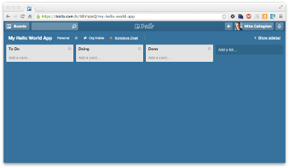
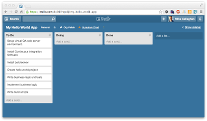
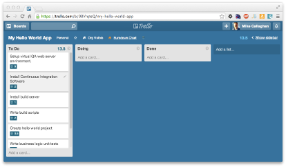
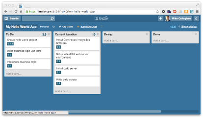
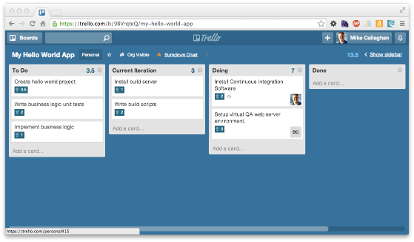
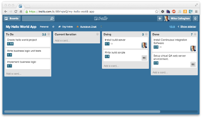
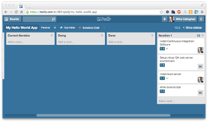

# Agile Software Development: A Quick Start Guide

## The Basics of Agile Software Development and How it Can Benefit Your Project

A recent tweet of mine seemed to get a lot of traction, so I decided to revisit an article from a few years ago, updated for today's software development needs.

Agile software development is a popular and effective way to build software. It emphasizes collaboration, flexibility, and regular delivery of working software. In this blog post, we'll introduce you to the basics of agile and explain how it can improve your team's software development process.

When starting a new software project, your team has a lot of decisions to make. Not the least of which is how to track the features from initial design through completion. Agile can help make the entire process easy and painless. Let's jump right in.

For the purposes of this article, I'm going to use Trello. If you want to follow along, doing so with Trello will be the simplest way, but you should be able to apply the ideas to any similar tracking system.

## Task Creation and Tracking

Setup with Trello is fast. Simply go to the [Trello website](https://www.trello.com/), logon (or create an account), create an organization for your team, add members, and set up a new board. By default, your board will include three empty lists:

Though your lists can be modified at any time, this is a great place to start, and will allow you to create a backlog of stories and tasks quickly, without regard to importance, how long a task might take to accomplish, or who will end up implementing them.

Every feature and idea that anyone has is fair game at this stage. Create a new card in the "To Do" list for every idea, user story, or task you can think of. As long as a card is in this list, anyone can make changes to it. Cards can be moved around at will, but should be sorted by importance. The more important cards are near the top. This forces you to make value judgments on the relative importance of your features. Because cards must be in order, no two cards can share the same significance. This eliminates the problem of every feature request being considered "critical." The most critical card is always the one on top.

All changes and comments to all cards are logged, so it's easy to look back and see a history of how a feature has evolved over time.

## Estimation

Estimates are important for planning and prioritizing work, even though they may not be completely accurate. As a project progresses, teams can use actual data and experience to refine their estimates and make them more accurate. By tracking progress against estimates, teams can identify potential issues and adjust their plans accordingly. Overall, estimates are a valuable tool for managing software development projects.

Most agile tracking tools have estimation capabilities included, but Trello has no built-in mechanism for estimating the time any particular card will take to complete.

There are informal methods for dealing with this, but one particularly clever idea is to use a web browser extension to make it painless for the entire team. [Scrum for Trello](https://scrumfortrello.com/) is a free browser extension for Chrome, Firefox and Safari that will let you place an estimate on each card's title.

Once the extension is installed, you can simply click on a card's title to set its estimate. A small row of numbers appears just under the title's text box. The numbers are the typical agile planning values from 0 to 21. Click on one to set it.

Your development team should go through each card in the To Do list and assign an estimate. Very simple tasks will probably get a 0.5 or 1. Extremely complicated tasks might get a 13 or 21. Those cards should be broken down into multiple cards so that every estimate is a single-digit number.

By design, the numbers do not contain units. They don't represent any particular measure of time.

Most Agile practitioners call them story points. For now, don't get hung up on what the numbers mean. They won't be accurate at the beginning even if you try. The important thing is that the developers are comfortable that each card has a value that is accurate, relative to the other cards in the list.

You will notice that the Scrum extension adds up the estimates for each card and displays the total at the top of the list, as well as the total of all cards on the board.

## Iteration Planning and Scheduling

Now it is time to start planning and scheduling your actual development work. You will want to agree with your team on a set period of time in which your work will be accomplished. Most Agile methodologies refer to this as an "iteration" or "sprint." It doesn't matter what you call it, and I will use the former term here.

The typical length of an iteration is two weeks, though some teams like to use one or three. One week iterations can work well for highly efficient teams doing very small tasks. Three week iterations work well for some teams, though I find it too long between planning and feedback.

This is also where you may want to consider making your first custom list in Trello. I like to create a new list between To Do and Doing. Simply click the "Add a list..." link to the right of your right-most list. Call it "Current Iteration." Create the list and drag it to the space between To Do and Doing. This is where the current work will go.

Your task at this point is to select the most important cards from the To Do list, and move them to the Current Iteration list. Remember that cards should already be organized by importance from top to bottom, so you simply need to drag them from one list to the other. As you do so, the Scrum extension will update the list's estimate. Continue dragging cards until the developers feel confident that they can complete the amount of work scheduled.

Developers should not be pressured to accept more work than they feel they can handle, especially in your first iteration.

## Development

Once your iteration is planned and cards are in the Current Iteration list, development work can begin. There are now a few rules that must be strictly enforced during the development phase. One is that no one is allowed to change any card's description or estimate. Another is that no cards be moved between the To Do and Current Iterations lists, with one exception that I will address shortly. These rules and a few more are summarized at the end of this post.

At the beginning of every day, the developers should get together to discuss what cards they intend to work on that day. No two developers can work on the same card simultaneously. Doing so indicates that there is more than one task on that card, and it should be split into multiple cards. You can do that if necessary, but be sure that the total estimate doesn't change.

As developers select a card to work on for the day, they will assign the card to themselves (select the card, click Members, and add themselves). Then the developer will move the card from Current Iteration to Doing, and begin to implement the feature on the card. Throughout development, comments and checklists can be freely added to the card.

The powerful thing about this is that everyone on the team can see the current state of development at any time at a glance, simply by loading the project's board. The boards update automatically when anything changes, so that all users see others' changes almost immediately.

If a developer has a question for someone else on the team, he can enter that question as a comment on the card, tagging the individual(s) expected to have the answer. Those tagged in a card will be pro-actively notified by Trello.

When the developer has finished implementing a particular card, drag it from Doing to Done. He can then take another card from Current Iteration, assign himself to it, and drag it to Doing. Developers continue to work in this way until the iteration ends or they run out of cards.

Running out of cards is the exception to the rule of not moving cards between To Do and Current Iteration. This simply indicates that the developers are working faster than initially expected. If this happens, management (in consultation with developers) should move one or more cards from To Do into Current Iteration, again based on importance. The developers can continue working until the iteration ends.

If the iteration ends with cards still in the Current Iteration list, don't consider it a failure of your estimation or planning. It just means you put in more cards than the developers were able to finish. This is important information that you can now use to help plan the next iteration.

## Calculating Velocity

At the end of your iteration, look at the number at the top of the Done list. This is your "velocity" for this iteration. Whatever that number is, use it as your number to plan the next iteration. For example, if the number at the top of Done is 150, then for your next iteration planning, try to plan cards so that your total estimate does not exceed 150. This is the reason you shouldn't concern yourself with each estimate's units. If you planned for 120 and the actual is 125, then your velocity is 125. Plan for 125 next time.

Likewise, if you only achieved 100, then use that for your next iteration's plan. It doesn't matter if the numbers represent hours, days, or something else entirely. That's why using an arbitrary term such as "story points" works so well. No one gets bogged down arguing over whether a task will take one or two hours.

Track your velocity from iteration to iteration. As each iteration completes, you will probably find that your planning and estimates get better. If your numbers vary drastically from iteration to iteration, it is an indication that something else may be affecting your velocity. A lower velocity may be a hint that something is hampering your developers' effectiveness. A slightly higher velocity could indicate that your team is starting to get comfortable with the process and with each other.

## Individual Velocity

Another metric you can track is velocity by developer. To determine each developer's individual velocity, simply add the story points of each card completed by each developer. This can be of tremendous value if your developers don't work the same number of hours each week on your project.

Let's say you are using two-week iterations, you have two full-time developers and one part-time. Plus you have an intern who works whenever he can. After a few iterations, your two full-time developers have average individual velocities of 50 and 55. Your part-time developer is averaging 20. And your intern averages 10. If you also know that your part-time developer is only working 3 days per week, you can assign him 20/6 or 3 1/3 "points" per day. The intern is working one day per week on your project, so you assign him 5 points per day. The two full-time developers also get roughly 5 points per day.

Once you've calculated individual velocities, it becomes a trivial task to see which of your developers is most effective. In my example, the part-time developer has a lower velocity than the rest. The others are all about the same.

This being a contrived example, I won't go into why some developers will have a higher velocity than others. There are many reasons for this, and only a few of them have anything to do with one developer being "better" than others.

Continuing the example, imagine that one of your developers will be on vacation for half of the next iteration. Knowing his velocity is 5 points per day, you can simply remove 25 points from your next iteration's maximum. If the intern gets an extra day next week, you can schedule another 5 points.

## Bugs and Testing

Your iterations should include cards for testing and bug fixes. Bugs should be treated no differently than other cards. If bugs are found during or after an iteration, they need to be added to the To Do list as individual cards, estimated, and scheduled into the next iteration. If the bug is truly exceptional and critical to finish in the current iteration, you may swap the bug fix for an existing card already scheduled, but not currently being worked on.

It is crucial that you do not add bugs to the Current Iteration unless you remove enough cards equal to the estimate of the bugs you are adding.

The overall estimate of the Current Iteration cannot change in the middle of an iteration. Sometimes you may be tempted to force a higher velocity on your team by adding more work hours or asking the developers to work harder, but that tactic will only work in the short-term, and is likely to backfire on you.

## Rinse and Repeat

At the end of every iteration, schedule a period of time (an hour or two) to review the work that was completed. This is the iteration's retrospective, where you will calculate and discuss your team's velocity. It is a good time to have a "[start, stop, and continue](https://www.people-results.com/start-stop-continue/)" review to determine what worked and didn't during the iteration, and what things can be improved for the next iteration. [Raw URL: https://www.people-results.com/start-stop-continue/]

Any cards remaining in the Current Iteration can be left there for the next iteration, or if management decides, can be put back into the To Do list for reevaluation. The same goes with cards in the Doing list, though because work has already started, it would be a waste to move them back into the To Do list. All cards in the Done list can be archived. Alternatively, you can rename the Done list with the current iteration number, and then archive the entire list. If you choose this route, simply create a new Done list to be used with the next iteration.

Once you have completed the retrospective, you can roll right into the planning for your next iteration, and repeat the process.

## Summary

Once you're become accustomed to working in this manner with Trello, you should find that your planning sessions become more productive, management will always know the state of the work being done, and developers will argue less over their estimates and work assigned to them. Eventually you will reach a state of predictable releases, which will make everyone happy.

### Rules to Live By

As I mentioned above, there are a few rules that everyone needs to agree to if you want to make this work. Many agile tracking systems can help enforce these rules. Other than logging all changes, Trello won't. It's up to the team to be professional and agree to stick to them.

- Anyone can add a card to the To Do list at any time
- Management can change any card in To Do.
- Only management can rearrange a card's priority in the To Do list in relation to another card.
- Only developers can provide or change a card's estimate, and only if that card is still in the To Do list.
- Once a card is scheduled, it cannot be modified, except by adding comments and checklists.
- Management may not touch cards that are in Current Iteration or Doing lists. They may comment on them freely, however.
- Developers assign themselves to cards during daily planning meetings. Management should never dictate who implements which cards.
- A developer can only be assigned to one card in the Doing list at a time.
- Only one developer should be assigned to a card. If multiple developers are assigned, it is a sign that the card is too complex and should be broken up.
- If a developer does not complete a card, it can be put back in the Current Iteration list to be finished later.

## Resources

- [Trello](https://www.trello.com/) [Raw URL: https://www.trello.com/]
- [Scrum for Trello](https://scrumfortrello.com/) [Raw URL: https://scrumfortrello.com/]

## Feedback

If you use Agile to manage your software development, and have other ideas and suggestions that help make your team more effectively, I'd love to hear about them.
